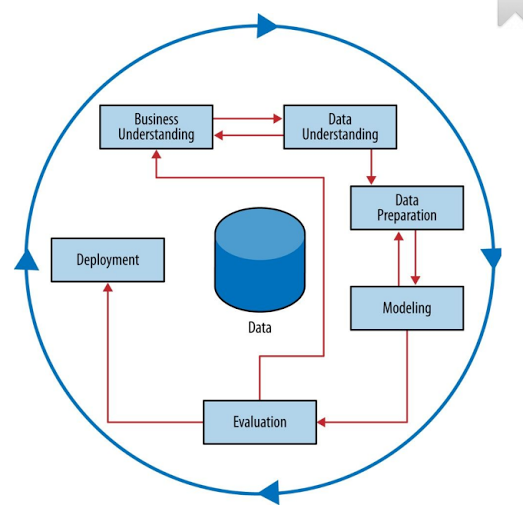
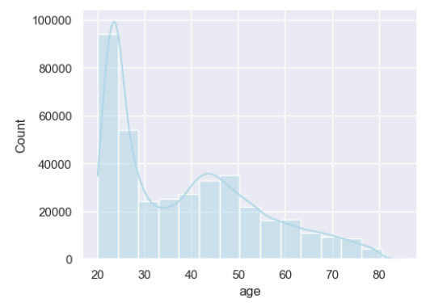
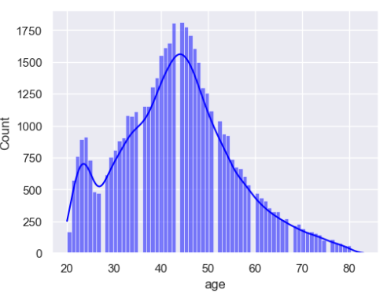
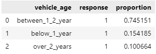
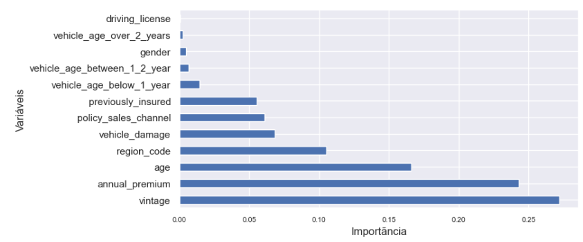
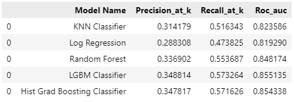
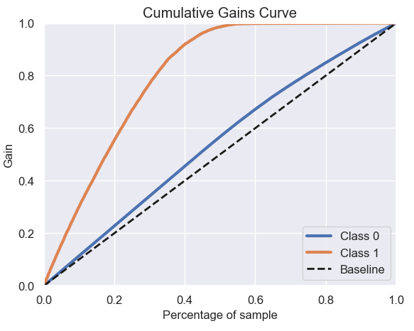
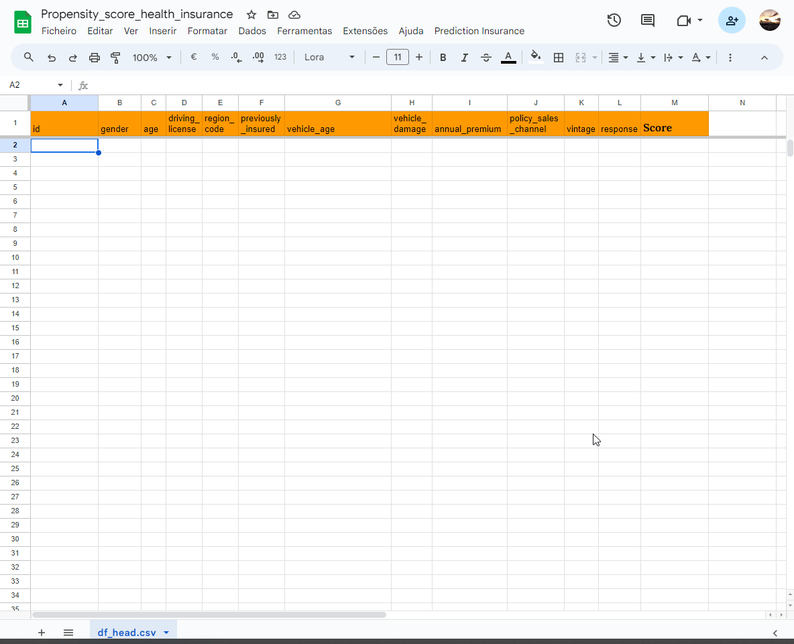

# Propensão de contratação de Seguro de Automóvel
## Usando um ranqueamento para classificar os clientes mais propensos a contratar o serviço

A empresa contratante é referência de mercado no ramo de Seguros de Saúde e quer ampliar seu portfólio oferecendo uma modalidade de Seguro Automotivo. Este projeto foca em usar a base de dados dos clientes do plano de Saúde, classifica-los e identificar os mais propensos a contratar esse novo serviço.

O ranqueamento e classificação se baseia em economizar recursos do serviço de Telemarketing e poupar tempo desde a implantação e ter uma quantidade substancial de novos contratados. Assim, apenas 20% da base será contatada (25mil usuários).

## 1. Os Dados

O dataset consiste nas seguintes variáveis:

| Variável 1            | Variável 2                                         |
|-----------------------|----------------------------------------------------|
| id                    | Identificação para cada cliente                    |
| gender                | Gênero do cliente                                  |
| age                   | Idade do Cliente                                   |
| region_code           | Código da região onde o cliente mora               |
| policy_sales_channel  | Código do canal de contato escolhido pelo cliente  |
| driving_license       | O cliente possui carteira de motorista?            |
| vehicle_age           | Idade do veículo do cliente                        |
| vehicle_damage        | O veículo já foi danificado antes?                 |
| previously_insured    | O cliente já possui seguro de automóvel ?          |
| annual_premium        | Valor do prêmio anual pago no seguro saúde         |
| vintage               | Tempo em que o cliente já tem o seguro saúde       |
| response              | O cliente estaria interessado em seguro automóvel? |

## 2. Estratégia para a solução
Adotamos uma estratégia cíclica muito usada nas ciência de dados, os CRISP-DM, que permite agilidade e eficiência na entrega. Por ser um método cíclico permite que retornemos etapas para melhorar o que já foi feito continuamente. Permite também revisões mais fáceis e atualizações mais constantes dos métodos de análise e treinamento.

O cíclo percorre as principais etapas e possui retrofeeback dos resultados para melhorar a etapa seguinte com informações da etapa anterior.

- Compreensão das particularidades de negócio;
- Compreensão dos dados coletados;
- Preparo dos dados (limpeza, retirada de outliers, criação de outras features);
- Treinamento do modelo;
- Avaliar a performance do modelo e realizar "ajustes finos";
- Avaliar se o resultado do modelo é condizente com o proposto pelo time de negócios.
- Implementar o modelo final em produção;
- Testar periodicamente a performance do modelo em produção.
  
 ## 3. Análise exploratória dos dados
Durante essa fase analisamos os dados para entender como estão distrubuídos e melhor adequá-lo para a predição.
Neste caso os dados são bastante desbalanceados, sendo bem maior a proporção de pessoas que não contrataram o seguro (Response = 0).

Quanto a idade temos uma distribuição em maior de indivíduos com idade entre 20 e 30 anos.

No entanto a distribuição de idade para quem contrata o serviço de seguro automotivo é maior para uma idade entre 38 a 50 anos.

Vendo uma distribuição de quem contrata o seguro, a maioria tem carro há, no máximo, 2 anos.

## 4. Aplicação do modelo de Machine Learning

Após a análise foram feitas transformações nas variáveis para que sejam melhor previstas pelo modelo. 
Depois dessas transformações foi feita uma análise de quais variáveis demonstram mais importância na predição e tivemos o seguinte gráfico:

Escolhemos as variáveis que demonstram valor de importãncia acima de 0,5.

### 4.1 Escolha de modelos

Com as variáveis transformadas e escolhidas, treinamos o modelo usando 5 tipos de algoritmos:

- K-Neighboors Classifier
- Logistic Regression
- Random Forest Classifier
- Light Boost Gradient Classifier
- Histogram Gradient Boosting Classifier

Analisamos as performances dos algoritmos escolhidos com base em algumas métricas listadas abaixo:
- Precision_at_K (Precisão em k): mede a proporção de itens relevantes entre os K primeiros itens recomendados pelo modelo. É útil quando estamos interessados na qualidade das recomendações.
- Recall_at_k (Revocação em k): mede a proporção de itens relevantes que foram realmente recomendados entre os K primeiros itens. É útil para avaliar o quanto o modelo consegue capturar todos os clientes que realmente contratarão o seguro.
- ROC_AUC (Área sobre a curva ROC): é uma medida da capacidade de separação do modelo de classificação em diferente limiares. Quanto maior a área, melhor o modelo separa e distingui entre as classes 0 e 1.
  
  Assim, tivemos os seguintes resultados com os testes desses diferentes modelos:

Com base nesses resultados o escolhido foi o modelo Histogram Gradient Boosting Classifier (HGBC).

### 4.2 Análise dos resultados
Ao escolher o modelo HGBC testamos ele no modelo de negócio, ou seja, o quanto ele consegue prever que contratará realmente o seguro usando apenas 20% da base de dados. Ele teve 57,1% de performance, assim, se contatarmos 20% da base, conseguiremos uma adesão de 57,1%, já se usassemos a base de forma aleatória, conseguiriamos alcançar apenas 20%.

### 4.3 Cumulative Gains Curve
A Cumulative Gains Curve (Curva de Ganhos Acumulados) é uma ferramenta de avaliação de modelo que mostra a taxa de sucesso acumulado ao classficar os exemplos positívos, comparando com uma classificação aleatória:

Podemos perceber pela curva laranja que o ganho de 20% da base é alcançar quase 60% dos interessados em contratar o seguro, já a linha tracejada seria uma abordagem aleatória. Caso a empresa consiga aumentar a capacidade de contatados para 40% da base, já alcançaria mais de 80% de interessados.

# 5. Integração do modelo com o Google Sheets
Estudando a melhor forma para que a equipe de negócios consiga utilizar o Modelo criado, foi feito uma integração com uma planilha do Google Sheets.

A Tabela tem exatamente os mesmos campos utilizados no treinamento do modelo, assim o responsável em cotatar os possíveis cliente preenche com os dados de vários clientes e ao execular o script, ele automaticamente informa o Score de que cada contato tem em contratar o seguro.

## 5.1 O Script
Utilizando JavaScript, o script lê os dados inseridos pelos usuários e os converte em um objeto JSON. Em seguida, ele envia essas informações para um modelo de machine learning hospedado na nuvem para processamento. O modelo analisa os dados e retorna previsões em formato JSON.

Posteriormente, o script recebe as previsões do modelo e as utiliza para preencher uma coluna adicional chamada "Score", que representa a probabilidade de um usuário com essas informações específicas contratar o seguro. O atendente pode então ordenar a tabela com base nos scores, permitindo identificar os usuários mais propensos a adquirir o serviço.

# 6. Resultados para a Empresa

Olhando pela análise da nossa base de dados, apenas 12,2% dos clientes cadastrados responderam estar interessados em adquirir o seguro. Sendo asim, usando uma abordagem aleatória, ou seja, escolher 20% dos 127.037 nomes que serão contatados sem tratamento prévio teríamos apenas **3100 contratações do seguro.**.

Usando nosso modelo de classificação de Machine Learning, teríamos uma taxa de 57,16% de contratação dentro dos 20.000 primeiros colocados, que resultaria em **8568 novas contratações do seguro**.

# 7. Licões aprendidas
1. Entender o pedido da empresa e utilizar os dados disponíveis para elaborar a melhor solução possível.
2. Mesmo com dados que não predizem muito a informação e que geram métricas não tão boas, é possível construir uma solução que impacte positivamente na rotina da empresa.
3. Construção de scripts usando o google script e JavaScript integrando-os a uma simples planilha.
4. Utilizar métricas que avaliem a performance ao escolher uma certa quantidade de dados (Recall at K, Precision at K).
   

